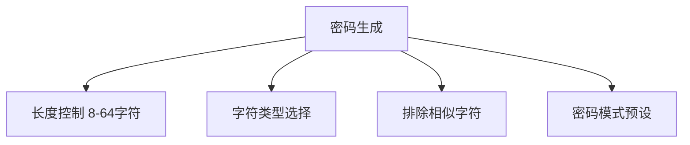

# Shield Forge - 密码生成器PRD文档

## 1. 产品概述
专为现代数字安全需求设计的密码生成解决方案，提供：
- 军工级加密算法（AES-256 + bcrypt）
- 可视化强度评估系统
- 跨平台兼容的响应式设计

## 2. 目标用户
| 用户类型         | 使用场景                 | 核心需求                      |
|------------------|--------------------------|-----------------------------|
| 普通网民         | 社交账号注册            | 快速生成易记忆密码           |
| IT管理员         | 企业账号管理            | 批量生成合规密码             |
| 开发者           | API集成                 | 可定制化的密码生成规则       |
| 安全敏感型用户   | 金融账户保护            | 军事级加密算法保障           |

## 3. 功能需求
### 3.1 核心功能

### 3.2 辅助功能
- 实时强度评估（熵值计算+可视化仪表）
- 密码保存建议（基于OWASP标准）

## 4. 非功能需求
| 指标           | 标准                      |
|----------------|--------------------------|
| 响应时间       | ≤300ms（不含加密计算）    |
| 兼容性         | Chrome/Firefox/Safari最新3个版本 |
| 安全性         | CSP3合规，XSS防护         |
| 可访问性       | WCAG 2.1 AA标准          |

## 其他说明
这是一个测试项目，主要是测试AI编写网页的能力，和code-server端口转发的能力。

## Cloudflare Pages
经过测试，能够在Cloudflare Pages上自动构建。